# Laporan Praktikum Jarkom Modul 1

# Tujuan Praktikum
Mempelajari wireshark dan cara install wireshark

# Penjelasan 
Wireshark adalah software untuk menganalisis lalu lintas jaringan (network traffic). Program ini dapat menangkap dan menampilkan paket data yang lewat di suatu jaringan secara detail.

# Hasil Praktikum & Lampiran
1.Kunjungi situs web resmi Wireshark melalui browser di alamat https://www.wireshark.org/download.html. dan Unduh installer yang sesuai dengan OS yang digunakan (seperti Windows atau Linux), pastikan memilih versi stabil terbaru.

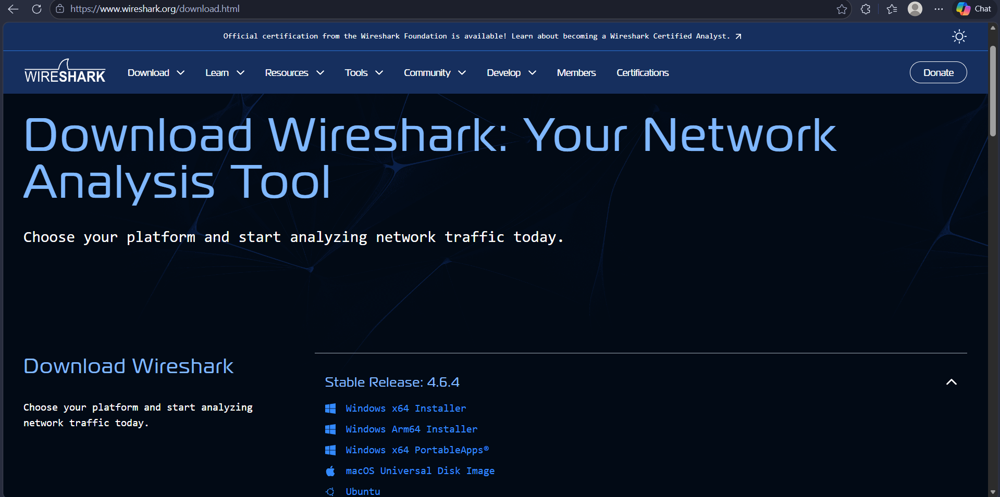

2.Setelah unduhan selesai, klik dua kali pada file installer untuk menjalankannya. dan Ikuti panduan instalasi step by step hingga prosesnya berakhir; tentukan folder instalasi dan tunggu sampai selesai. Instalasi berjalan tanpa kendala, hanya butuh waktu beberapa menit hingga Wireshark siap digunakan.

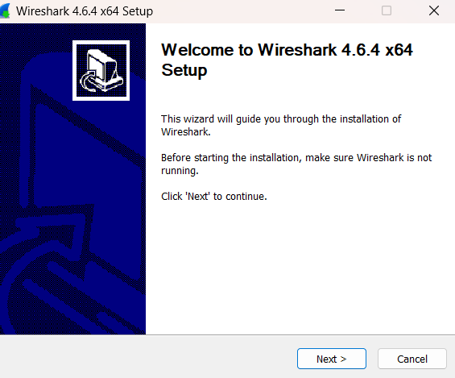
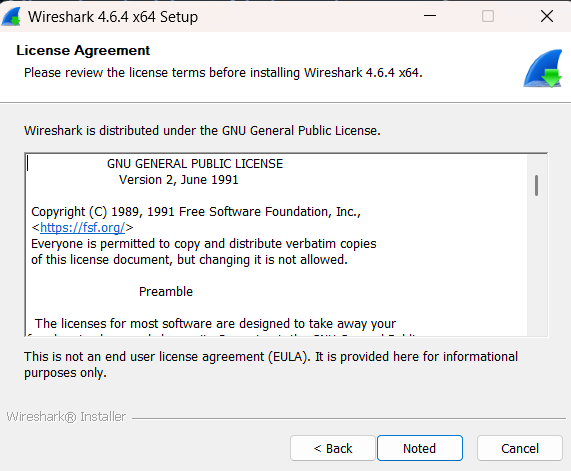
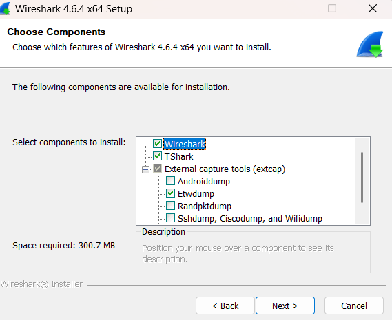

3.Pada bagian ini user bisa memilih mau di letakkan dimana untuk wiresharknya

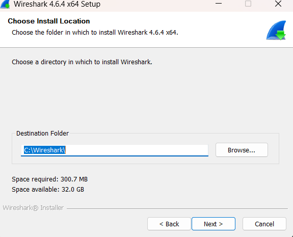

4.Tekan next dan finish

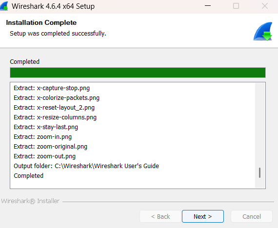
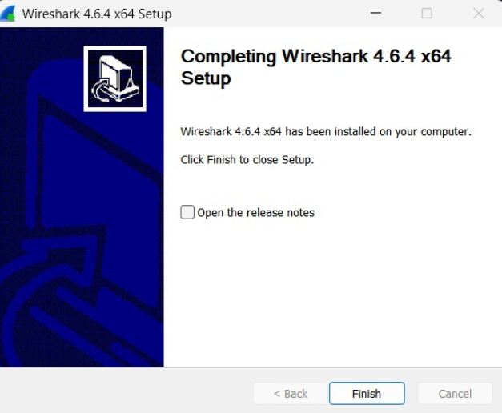

# Laporan Praktikum Jarkom Modul 2
Basic HTTP GET atau response interaction

# Hasil Praktikum & Lampiran
1.Pertama, buka dulu Wireshark.

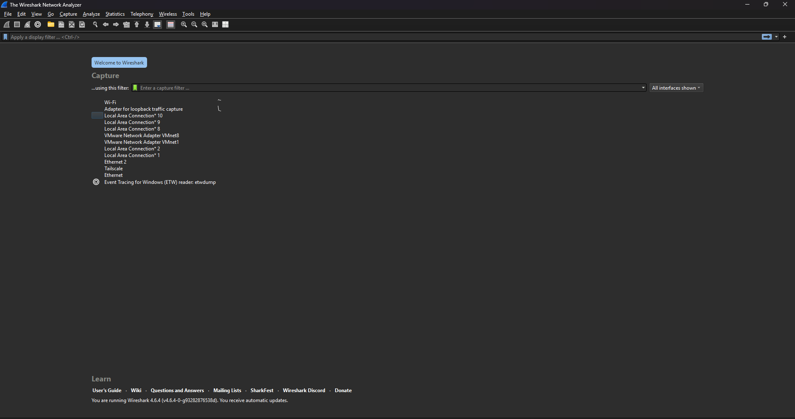

2.Untuk mulai capture, pilih WiFi. Kalau kamu pakai VPN, matikan dulu ya. Caranya tinggal double klik tulisan WiFi.

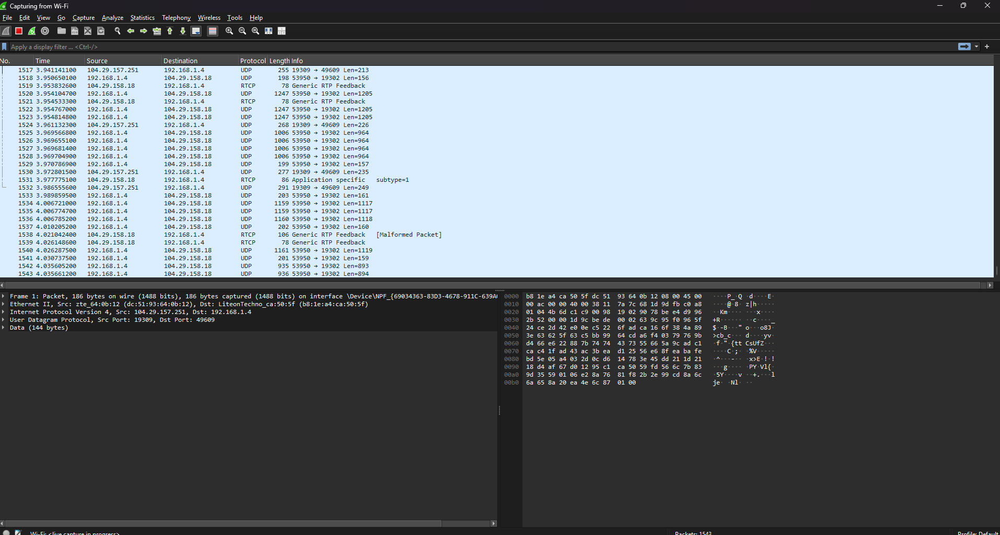

3.Setelah itu buka link ini:
http://gaia.cs.umass.edu/wireshark-labs/INTRO-wireshark-file1.html
Pastikan di browser pakainya http.
Nanti di browser akan muncul halaman HTML sederhana yang hanya berisi satu baris tulisan:
“Congratulations! You've downloaded the first Wireshark lab file!”

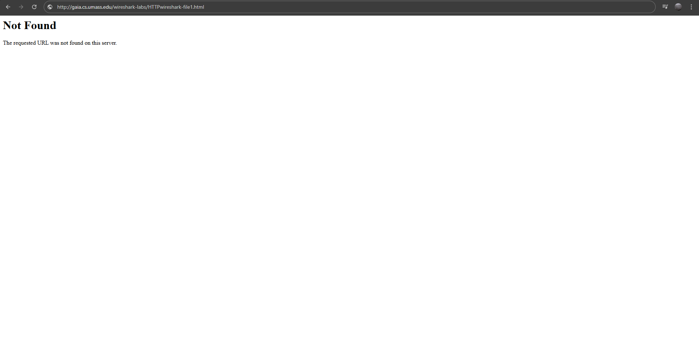

4.Selanjutnya, di kolom filter Wireshark, ketik http (tanpa tanda kutip).

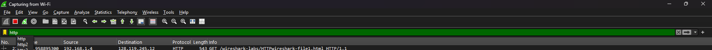

5.Lalu pilih paket yang ada tulisan (text/html).Setelah itu klik panah di bagian “Line-based text data”, nanti isi datanya akan muncul.

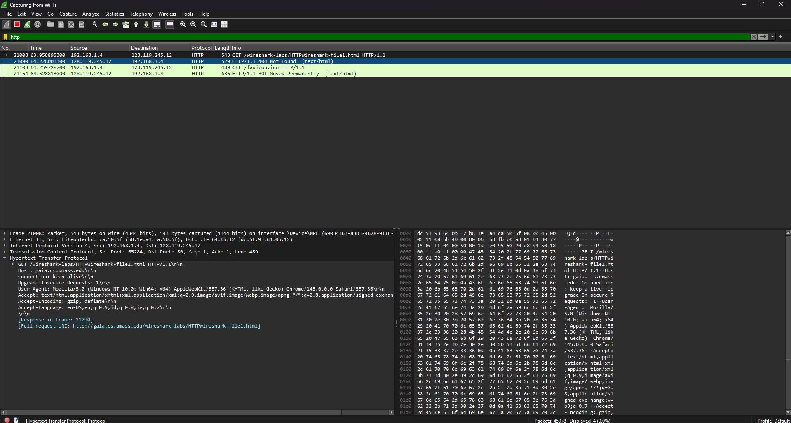