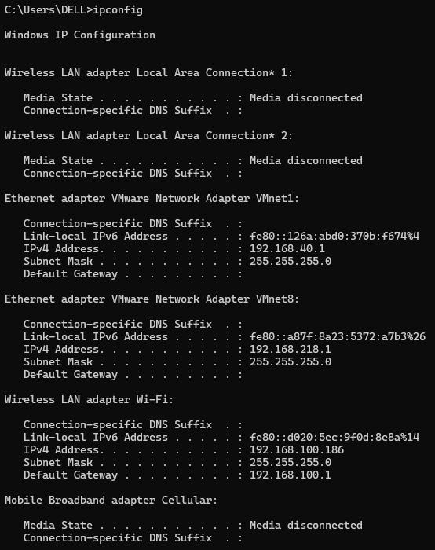
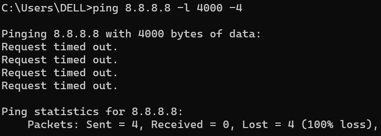
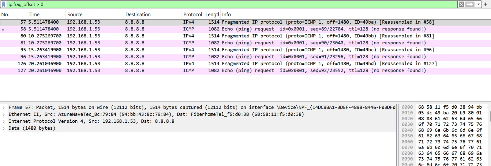
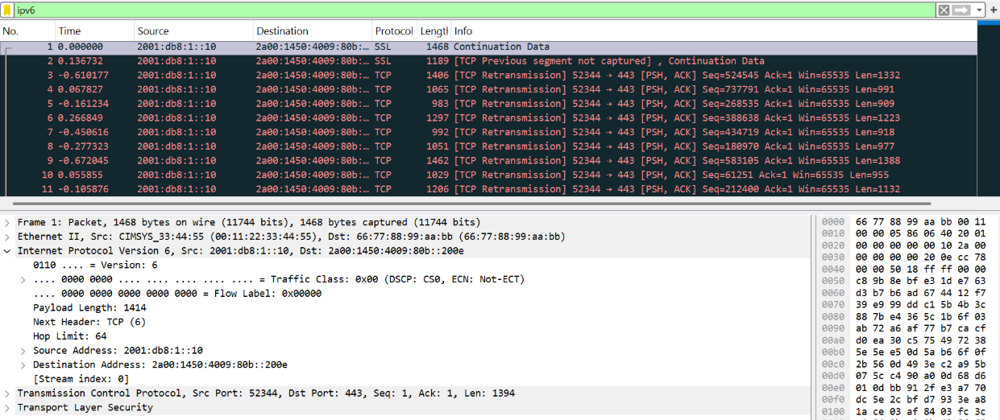

# Modul 10 IP

## Pengertian IP Address

IP Address (*Internet Protocol Address*) merupakan alamat unik yang diberikan kepada setiap perangkat yang terhubung ke jaringan komputer maupun internet. Fungsi utamanya adalah sebagai identitas perangkat sehingga data dapat dikirim dan diterima ke tujuan yang benar. Sama seperti alamat rumah yang digunakan untuk mengirim surat, IP Address digunakan untuk menentukan tujuan pengiriman paket data di jaringan.

Secara umum terdapat dua versi IP Address yang digunakan saat ini:

- **IPv4 (Internet Protocol Version 4)** menggunakan alamat sepanjang 32-bit, contohnya `192.168.1.1`.
- **IPv6 (Internet Protocol Version 6)** menggunakan alamat sepanjang 128-bit, contohnya `2001:db8:85a3::7334`.

IPv6 dikembangkan untuk mengatasi keterbatasan jumlah alamat yang tersedia pada IPv4.

Berdasarkan penggunaannya, IP Address dibagi menjadi:

- **Public IP**, yaitu alamat yang dapat diakses secara langsung dari internet dan bersifat unik secara global.
- **Private IP**, yaitu alamat yang digunakan pada jaringan lokal dan tidak dapat diakses langsung dari internet.

Rentang alamat private IP yang umum digunakan adalah:

- `10.0.0.0 – 10.255.255.255`
- `172.16.0.0 – 172.31.255.255`
- `192.168.0.0 – 192.168.255.255`

Selain itu, terdapat dua jenis IP berdasarkan cara pemberiannya:

- **Dynamic IP**, diberikan secara otomatis oleh DHCP dan dapat berubah sewaktu-waktu.
- **Static IP**, ditetapkan secara manual dan biasanya digunakan pada server.

Ketika pengguna mengakses sebuah website, sistem DNS akan menerjemahkan nama domain menjadi alamat IP. Selanjutnya perangkat akan mengirimkan permintaan ke alamat tersebut dan server akan mengirimkan respons kembali melalui jaringan internet.

IP Address memiliki beberapa fungsi utama, yaitu:

1. Sebagai identitas perangkat dalam jaringan.
2. Menunjukkan lokasi perangkat pada suatu jaringan.
3. Membantu proses routing agar paket data sampai ke tujuan yang tepat.

Untuk melihat alamat IP pada Windows, dapat menggunakan perintah berikut:

```bash
ipconfig
```

Sedangkan pada Linux atau macOS dapat menggunakan:

```bash
ifconfig
```

Tampilan hasilnya akan terlihat seperti berikut.



---

# Traceroute Dari Suatu Website


Perintah **tracert** digunakan untuk mengetahui jalur yang dilalui paket data dari komputer pengguna menuju server tujuan. Pada percobaan ini dilakukan pelacakan menuju domain **youtube.com**.

Hasil yang diperoleh menunjukkan bahwa paket berhasil mencapai server tujuan setelah melewati sejumlah router atau *hop*. Pada beberapa hop terdapat pesan **Request Timed Out**, namun paket tetap dapat mencapai tujuan akhir.

Hop pertama menunjukkan router lokal dengan alamat `192.168.100.1`, sedangkan hop berikutnya merupakan gateway dari ISP. Selanjutnya paket melewati beberapa router milik penyedia layanan internet dan jaringan Google sebelum akhirnya mencapai server YouTube.

---

## Analisis

Berdasarkan waktu respons yang ditampilkan pada setiap hop, terlihat bahwa hop awal memiliki nilai latency yang sangat rendah, yaitu sekitar 1–6 ms. Hal ini menunjukkan bahwa komunikasi pada jaringan lokal berlangsung dengan sangat cepat.

Ketika paket memasuki jaringan ISP, latency meningkat menjadi sekitar 20–30 ms. Setelah memasuki jaringan backbone Google, nilai latency relatif stabil dan tidak mengalami peningkatan yang signifikan.

Munculnya pesan **Request Timed Out** pada beberapa hop bukan berarti koneksi gagal. Kondisi tersebut biasanya terjadi karena router pada jalur tersebut dikonfigurasi untuk tidak merespons paket ICMP demi alasan keamanan atau efisiensi jaringan.

Karena paket tetap berhasil mencapai server tujuan pada hop terakhir, dapat disimpulkan bahwa koneksi menuju YouTube berjalan normal dan stabil.

---

# Apa Itu ICMP, MTU, dan TTL

## ICMP (Internet Control Message Protocol)

ICMP merupakan protokol yang digunakan untuk mengirimkan informasi diagnostik dan pesan kesalahan pada jaringan komputer. Protokol ini tidak digunakan untuk membawa data aplikasi seperti TCP atau UDP.

Contoh penggunaan ICMP adalah pada perintah:

```bash
ping 8.8.8.8
```

Saat perintah dijalankan, komputer mengirimkan paket **ICMP Echo Request** ke alamat tujuan. Jika tujuan dapat dijangkau, maka akan dikirimkan balasan berupa **ICMP Echo Reply**.

ICMP juga digunakan untuk memberikan informasi seperti:

- Host tidak dapat dijangkau (*Destination Unreachable*)
- Waktu hidup paket habis (*Time Exceeded*)
- Redirect jaringan

Pada hasil tracert sebelumnya, pesan **Request Timed Out** muncul karena router tidak memberikan respons terhadap paket ICMP yang dikirim.

---

## MTU (Maximum Transmission Unit)

MTU adalah ukuran maksimum paket data yang dapat dikirimkan melalui suatu antarmuka jaringan tanpa perlu dilakukan fragmentasi.

Nilai MTU standar pada jaringan Ethernet adalah:

```text
1500 byte
```

Jika ukuran paket melebihi nilai MTU, maka paket harus dipecah menjadi beberapa bagian yang lebih kecil atau mengalami kegagalan pengiriman.

Pengujian MTU dapat dilakukan menggunakan perintah:

```bash
ping -f -l 1472 8.8.8.8
```

Perhitungan ukuran paket:

```text
1472 byte data
20 byte header IP
8 byte header ICMP
-------------------
1500 byte
```

Jika paket berhasil dikirim tanpa fragmentasi, maka MTU jaringan mendukung ukuran tersebut.

---

## TTL (Time To Live)

TTL adalah nilai yang terdapat pada header IP yang berfungsi untuk membatasi jumlah hop yang dapat dilewati oleh sebuah paket.

Setiap kali paket melewati router, nilai TTL akan berkurang satu. Ketika nilai TTL mencapai nol, paket akan dibuang dan router akan mengirimkan pesan ICMP Time Exceeded kepada pengirim.

TTL digunakan untuk mencegah paket berputar tanpa akhir akibat kesalahan routing.

Contoh penerapan TTL dapat dilihat pada perintah:

```bash
tracert youtube.com
```

Perintah tracert bekerja dengan mengirimkan paket menggunakan nilai TTL yang terus meningkat, mulai dari 1, 2, 3, dan seterusnya. Dengan cara ini setiap router yang dilalui dapat diidentifikasi satu per satu.

Nilai TTL awal yang umum digunakan adalah:

- Windows : 128
- Linux/macOS : 64

---

# Contoh Fragmentasi Pada Wireshark

## Langkah-Langkah

1. Jalankan Wireshark dan mulai proses capture pada interface jaringan yang aktif.

2. Kirim paket berukuran besar melalui Command Prompt menggunakan perintah berikut:

```bash
ping 8.8.8.8 -l 4000 -4
```



3. Hentikan proses capture pada Wireshark.

4. Gunakan filter berikut:

```text
ip.frag_offset > 0
```

5. Amati paket yang muncul pada hasil capture.



## Hasil Pengamatan

Setelah filter diterapkan, terlihat beberapa paket yang mengalami fragmentasi. Paket-paket tersebut ditandai dengan informasi **Fragmented IP Protocol** dan memiliki nilai **Fragment Offset** tertentu.

Nilai fragment offset menunjukkan posisi masing-masing potongan paket terhadap data asli. Selain itu terdapat informasi **Reassembled**, yang menunjukkan bahwa paket-paket yang terfragmentasi dapat digabungkan kembali oleh perangkat penerima.

Fragmentasi terjadi karena ukuran paket yang dikirim sebesar 4000 byte melebihi nilai MTU jaringan yang umumnya sekitar 1500 byte.

Walaupun pada Command Prompt muncul pesan **Request Timed Out**, paket tetap dapat diamati melalui Wireshark sehingga proses fragmentasi dapat dianalisis dengan jelas.

---

# IPv6 Pada Wireshark

## Langkah-Langkah

1. Buka file **ipv6_sample.pcap** menggunakan Wireshark.
2. Masukkan filter berikut:

```text
ipv6
```

3. Pilih salah satu paket yang muncul.
4. Amati bagian **Internet Protocol Version 6 (IPv6)** pada detail paket.



## Hasil Pengamatan

Setelah dilakukan proses penyaringan menggunakan filter IPv6, ditemukan beberapa paket yang menggunakan protokol IPv6.

Pada salah satu paket yang diamati diperoleh informasi sebagai berikut:

```text
Source Address      : 2001:db8:1::10
Destination Address : 2a00:1450:4009:80b::200e
```

Alamat tersebut menggunakan format IPv6 yang terdiri atas kombinasi angka heksadesimal dan dipisahkan oleh tanda titik dua (`:`).

IPv6 merupakan pengembangan dari IPv4 yang menggunakan panjang alamat 128-bit. Dengan ruang alamat yang jauh lebih besar, IPv6 mampu menyediakan jumlah alamat yang sangat banyak dibandingkan IPv4.

Pada Wireshark, paket IPv6 dapat dikenali melalui label **Internet Protocol Version 6** serta format alamat sumber dan tujuan yang berbeda dari IPv4.

Penggunaan IPv6 bertujuan untuk mengatasi keterbatasan jumlah alamat IPv4 serta meningkatkan efisiensi pengelolaan jaringan pada skala yang lebih besar.