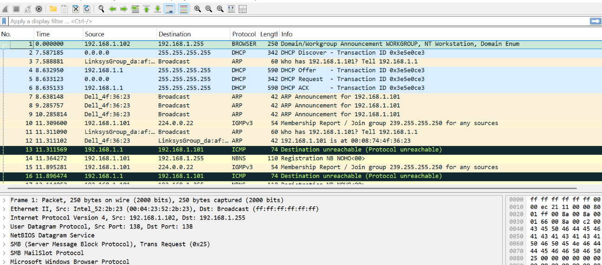
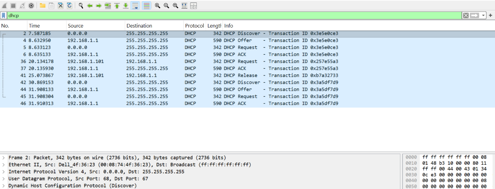

# Modul 11 DHCP

## Pengertian DHCP

DHCP (*Dynamic Host Configuration Protocol*) merupakan protokol jaringan yang digunakan untuk memberikan konfigurasi jaringan secara otomatis kepada perangkat yang terhubung ke jaringan. Konfigurasi tersebut meliputi alamat IP, subnet mask, default gateway, serta alamat DNS.

Dengan adanya DHCP, pengguna tidak perlu melakukan pengaturan alamat IP secara manual pada setiap perangkat. Ketika sebuah perangkat terhubung ke jaringan, DHCP Server akan secara otomatis menyediakan alamat IP yang dapat digunakan oleh perangkat tersebut untuk berkomunikasi di dalam jaringan maupun mengakses internet.

Konsep DHCP dapat dianalogikan seperti petugas hotel yang memberikan nomor kamar kepada tamu yang datang. Setiap tamu memperoleh kamar yang berbeda sehingga tidak terjadi benturan penggunaan kamar. Begitu pula DHCP yang memastikan setiap perangkat memperoleh alamat IP yang unik.

Penggunaan DHCP memberikan banyak keuntungan, terutama pada jaringan yang memiliki banyak perangkat seperti rumah, sekolah, kampus, maupun kantor. Dengan sistem ini, pengelolaan alamat IP menjadi lebih mudah, cepat, dan efisien.

---

# Kelebihan dan Kekurangan DHCP

## Kelebihan DHCP

### 1. Konfigurasi Otomatis

DHCP memungkinkan perangkat memperoleh konfigurasi jaringan secara otomatis tanpa perlu pengaturan manual. Hal ini memudahkan administrator maupun pengguna dalam menghubungkan perangkat ke jaringan.

### 2. Menghindari Konflik IP

DHCP mengelola pembagian alamat IP sehingga setiap perangkat mendapatkan alamat yang berbeda. Dengan demikian, risiko terjadinya konflik alamat IP dapat diminimalkan.

### 3. Efisien pada Jaringan Besar

Pada jaringan dengan banyak perangkat, DHCP sangat membantu karena administrator tidak perlu mengatur alamat IP satu per satu. Setiap perangkat yang terhubung akan memperoleh konfigurasi secara otomatis.

### 4. Pemanfaatan Alamat IP Lebih Optimal

Alamat IP diberikan menggunakan sistem *lease* atau masa sewa. Ketika perangkat tidak lagi terhubung ke jaringan, alamat IP tersebut dapat digunakan kembali oleh perangkat lain.

### 5. Pengelolaan Terpusat

Perubahan konfigurasi jaringan seperti DNS atau gateway cukup dilakukan pada DHCP Server. Seluruh perangkat klien akan memperoleh konfigurasi terbaru secara otomatis.

---

## Kekurangan DHCP

### 1. Kurang Cocok untuk Server

Perangkat yang membutuhkan alamat IP tetap, seperti web server, printer jaringan, atau kamera CCTV, kurang cocok menggunakan DHCP karena alamat IP dapat berubah sewaktu-waktu.

### 2. Ketergantungan pada Masa Sewa (Lease)

Jika proses pembaruan lease gagal dilakukan, perangkat dapat kehilangan alamat IP sehingga koneksi ke jaringan menjadi terganggu.

### 3. Bergantung pada DHCP Server

Apabila DHCP Server mengalami gangguan atau tidak aktif, perangkat baru tidak dapat memperoleh alamat IP secara otomatis.

### 4. Risiko Keamanan

DHCP rentan terhadap keberadaan *Rogue DHCP Server*, yaitu server DHCP tidak resmi yang dapat memberikan konfigurasi jaringan palsu dan berpotensi mengganggu keamanan jaringan.

### 5. Sulit Melakukan Pelacakan Berdasarkan IP

Karena alamat IP dapat berubah secara otomatis, proses identifikasi perangkat berdasarkan alamat IP menjadi lebih sulit dibandingkan penggunaan IP statis.

---

# DORA

DORA merupakan singkatan dari:

- **Discover**
- **Offer**
- **Request**
- **Acknowledgment**

Keempat tahap tersebut merupakan proses yang dilakukan oleh DHCP untuk memberikan alamat IP kepada klien secara otomatis.

---

## Langkah-Langkah

1. Buka file **dhcp-ethereal-trace-1** menggunakan Wireshark.



2. Gunakan filter berikut untuk menampilkan paket DHCP.

```text
dhcp
```



---

## Analisis Proses DORA

Berdasarkan hasil pengamatan pada Wireshark, terlihat empat paket utama yang menunjukkan proses pemberian alamat IP oleh DHCP Server.

### 1. Discover

Tahap pertama dimulai ketika klien mengirimkan paket **DHCP Discover**.

Pada tahap ini klien belum memiliki alamat IP sehingga menggunakan alamat sumber **0.0.0.0** dan mengirimkan paket ke alamat broadcast **255.255.255.255**.

Tujuan dari paket ini adalah mencari DHCP Server yang tersedia di dalam jaringan.

### 2. Offer

Setelah menerima paket Discover, DHCP Server memberikan respons berupa **DHCP Offer**.

Paket ini berisi tawaran alamat IP yang dapat digunakan oleh klien beserta informasi jaringan lainnya seperti:

- Subnet Mask
- Default Gateway
- DNS Server
- Lease Time

Pada hasil pengamatan, DHCP Server menggunakan alamat IP **192.168.1.1**.

### 3. Request

Setelah menerima tawaran dari server, klien mengirimkan paket **DHCP Request**.

Paket ini digunakan untuk menyatakan bahwa klien menerima alamat IP yang ditawarkan dan meminta agar alamat tersebut dialokasikan secara resmi.

Paket Request dikirim secara broadcast agar seluruh DHCP Server pada jaringan mengetahui pilihan klien terhadap server yang dipilih.

### 4. Acknowledgment (ACK)

Tahap terakhir adalah **DHCP ACK (Acknowledgment)**.

Pada tahap ini DHCP Server mengonfirmasi bahwa alamat IP telah berhasil dialokasikan kepada klien. Selain alamat IP, server juga mengirimkan konfigurasi jaringan lain yang diperlukan.

Setelah menerima paket ACK, perangkat klien dapat mulai menggunakan jaringan secara normal.

---

## Hasil Pengamatan

Berdasarkan hasil analisis menggunakan Wireshark, proses DORA berlangsung dengan urutan yang benar yaitu **Discover → Offer → Request → ACK**.

DHCP Server yang digunakan memiliki alamat IP **192.168.1.1**, sedangkan pada awal proses klien menggunakan alamat **0.0.0.0** karena belum memperoleh konfigurasi jaringan.

Setelah tahap ACK selesai, klien berhasil memperoleh alamat IP beserta konfigurasi jaringan lainnya secara otomatis. Hal ini menunjukkan bahwa proses DHCP berjalan dengan baik dan perangkat dapat terhubung ke jaringan tanpa perlu konfigurasi manual.