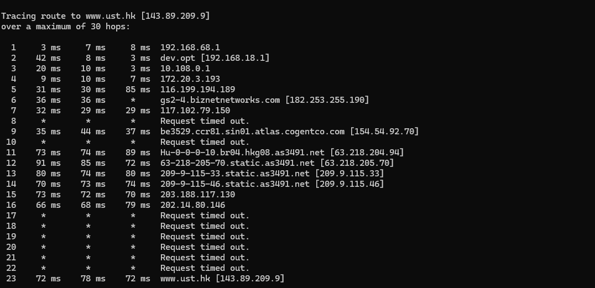
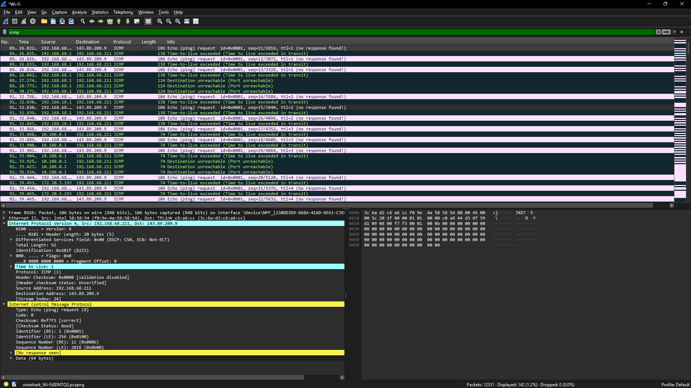
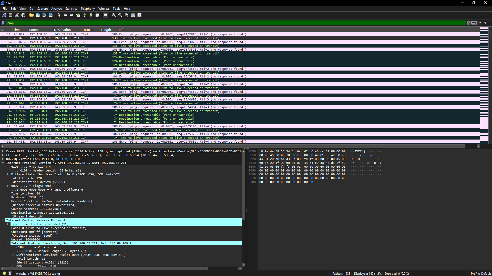

# Modul 12

# ICMP

ICMP (*Internet Control Message Protocol*) merupakan salah satu protokol pendukung dalam jaringan komputer yang digunakan untuk mengirimkan informasi kontrol, diagnostik, dan laporan kesalahan. ICMP bekerja bersama protokol IP untuk membantu proses komunikasi jaringan agar berjalan dengan baik.

Berbeda dengan TCP dan UDP yang digunakan untuk mengirim data pengguna, ICMP digunakan untuk memberikan informasi mengenai kondisi jaringan, status koneksi, serta berbagai pesan kesalahan yang terjadi selama proses pengiriman paket.

## Fungsi ICMP

ICMP memiliki beberapa fungsi penting dalam jaringan, antara lain:

1. Membantu melakukan diagnosis terhadap kondisi jaringan.
2. Memeriksa apakah suatu host atau perangkat dapat dijangkau.
3. Mengirimkan informasi kesalahan ketika terjadi gangguan dalam proses pengiriman paket.
4. Membantu proses pemantauan dan troubleshooting jaringan.
5. Mendukung utilitas jaringan seperti **ping** dan **traceroute/tracert**.

---

## Kegunaan ICMP

Beberapa penggunaan ICMP yang paling umum adalah sebagai berikut:

1. Menguji konektivitas jaringan menggunakan perintah **ping**.
2. Menelusuri jalur yang dilalui paket data menggunakan **tracert** atau **traceroute**.
3. Memberikan pesan kesalahan seperti **Destination Unreachable** ketika tujuan tidak dapat dicapai.
4. Mengirimkan pesan **Time Exceeded** ketika nilai TTL pada paket telah habis sebelum mencapai tujuan.

---

## Hubungan IP dan ICMP

ICMP bekerja di atas protokol IP dan digunakan untuk mendukung proses komunikasi yang dilakukan oleh IP.

Ketika sebuah paket IP mengalami masalah selama proses pengiriman, ICMP akan mengirimkan pesan informasi atau kesalahan kepada pengirim. Dengan demikian, ICMP berfungsi sebagai mekanisme pelaporan dan pemantauan yang membantu IP dalam menjaga komunikasi jaringan tetap berjalan dengan baik.

Karena itu, ICMP tidak digunakan untuk membawa data aplikasi pengguna, melainkan hanya membawa pesan kontrol dan informasi jaringan.

---

## Struktur Paket ICMP

Sebuah paket ICMP umumnya memiliki beberapa komponen utama sebagai berikut:

1. **Type**  
   Menunjukkan jenis pesan ICMP yang dikirim.

2. **Code**  
   Memberikan informasi tambahan yang lebih spesifik mengenai tipe pesan.

3. **Checksum**  
   Digunakan untuk memverifikasi integritas data pada paket ICMP.

4. **Identifier**  
   Berfungsi sebagai identitas paket agar dapat dicocokkan dengan paket balasannya.

5. **Sequence Number**  
   Menunjukkan urutan paket yang dikirim.

6. **Data (Payload)**  
   Berisi data tambahan yang dikirim bersama pesan ICMP.

Komponen-komponen tersebut memungkinkan ICMP digunakan untuk memantau konektivitas, mendeteksi kesalahan, dan menganalisis performa jaringan.

---

# Analisis ICMP yang Dihasilkan Oleh Ping

## Langkah-Langkah

1. Jalankan aplikasi Wireshark dan pilih interface jaringan yang aktif (Wi-Fi).

2. Buka Command Prompt kemudian jalankan perintah berikut:

```bash
ping -n 10 www.ust.hk
```

.png)

3. Hentikan proses capture pada Wireshark.

4. Gunakan filter berikut:

```text
icmp
```

5. Pilih salah satu paket **ICMP Echo Request**.

6. Pilih salah satu paket **ICMP Echo Reply**.

---

## Hasil Analisis Wireshark

### ICMP Echo Request

.png)

1. **Type = 8**  
   Menunjukkan bahwa paket merupakan ICMP Echo Request yang digunakan untuk mengirim permintaan ping ke host tujuan.

2. **Code = 0**  
   Menunjukkan bahwa tidak terdapat informasi tambahan atau kondisi kesalahan pada paket tersebut.

3. **Checksum = 0x4d5a [correct]**  
   Menandakan bahwa integritas paket terjaga dan tidak terjadi kerusakan data selama transmisi.

4. **Identifier = 1 (0x0001)**  
   Digunakan sebagai identitas untuk mencocokkan paket permintaan dengan paket balasan.

5. **Sequence Number = 1 (0x0001)**  
   Menunjukkan bahwa paket tersebut merupakan paket ping pertama yang dikirim.

6. **Informasi Paket**  
   Paket dikirim dari alamat IP **192.168.68.155** menuju **143.89.209.9** dengan ukuran sekitar 74 byte.

---

### ICMP Echo Reply

.png)

1. **Type = 0**  
   Menunjukkan bahwa paket merupakan ICMP Echo Reply atau balasan terhadap permintaan ping.

2. **Code = 0**  
   Menandakan tidak terdapat informasi kesalahan tambahan.

3. **Checksum = 0x555a [correct]**  
   Menunjukkan bahwa paket diterima dalam kondisi yang baik tanpa kerusakan data.

4. **Identifier = 1 (0x0001)**  
   Nilainya sama dengan paket Echo Request untuk memastikan bahwa balasan sesuai dengan permintaan yang dikirim.

5. **Sequence Number = 1 (0x0001)**  
   Menunjukkan bahwa paket tersebut merupakan balasan untuk paket ping pertama.

6. **Response Time = 74,827 ms**  
   Menunjukkan waktu yang diperlukan sejak Echo Request dikirim hingga Echo Reply diterima.

7. **Informasi Paket**  
   Paket dikirim dari alamat IP **143.89.209.9** menuju **192.168.68.155** dengan ukuran sekitar 78 byte. Hal ini menunjukkan bahwa host tujuan berhasil merespons permintaan ping dengan baik.

---

## Kesimpulan Analisis Ping

Berdasarkan hasil pengamatan pada Wireshark, proses ping menghasilkan pasangan paket ICMP berupa **Echo Request** dan **Echo Reply**. Host tujuan berhasil memberikan respons terhadap seluruh permintaan yang dikirim, sehingga dapat disimpulkan bahwa konektivitas jaringan berjalan dengan baik.

---

# Analisis ICMP yang Dihasilkan Oleh Traceroute

## Langkah-Langkah

1. Jalankan kembali Wireshark dan pilih interface jaringan yang aktif.

2. Buka Command Prompt kemudian jalankan perintah berikut:

```bash
tracert www.ust.hk
```



3. Hentikan proses capture setelah traceroute selesai.

4. Terapkan filter:

```text
icmp
```

5. Pilih salah satu paket **ICMP Echo Request**.

6. Pilih salah satu paket **ICMP Time Exceeded**.

---

## Hasil Analisis Wireshark

### 1. ICMP Echo Request



- **Type = 8**  
  Menunjukkan bahwa paket merupakan Echo Request.

- **Code = 0**  
  Menandakan tidak terdapat informasi kesalahan tambahan.

- **Checksum = 0xf7ae [correct]**  
  Menunjukkan bahwa paket tidak mengalami kerusakan selama pengiriman.

- **Identifier = 1 (0x0001)**  
  Digunakan sebagai identitas paket yang dikirim.

- **Sequence Number = 80 (0x0050)**  
  Menunjukkan bahwa paket tersebut merupakan paket urutan ke-80.

---

### 2. ICMP Time Exceeded



- **Type = 11**  
  Menunjukkan bahwa paket merupakan pesan ICMP Time Exceeded.

- **Code = 0**  
  Menandakan bahwa nilai TTL habis selama perjalanan menuju tujuan (*TTL Exceeded in Transit*).

- **Checksum = 0xf4ff [correct]**  
  Menunjukkan bahwa paket diterima tanpa mengalami kesalahan.

- **Source IP = 192.168.68.1**  
  Router yang mengirimkan pesan Time Exceeded.

- **Destination IP = 192.168.68.155**  
  Komputer yang menjalankan perintah traceroute.

- **Time To Live (TTL) = 1**  
  Menunjukkan bahwa paket asli dikirim dengan nilai TTL yang sangat kecil sehingga habis pada router pertama.

---

## Kesimpulan Analisis Traceroute

Traceroute bekerja dengan mengirimkan paket yang memiliki nilai TTL berbeda secara bertahap. Ketika nilai TTL habis pada suatu router, router tersebut akan mengirimkan pesan **ICMP Time Exceeded** kepada pengirim.

Melalui mekanisme ini, setiap router (*hop*) yang dilewati paket dapat diidentifikasi satu per satu hingga mencapai tujuan akhir. Hasil pengamatan pada Wireshark menunjukkan bahwa paket ICMP Time Exceeded berhasil digunakan untuk mengetahui jalur yang ditempuh paket selama proses komunikasi jaringan berlangsung.