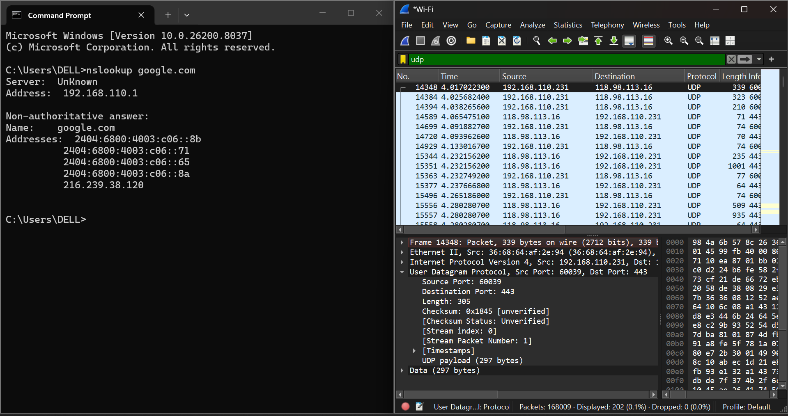
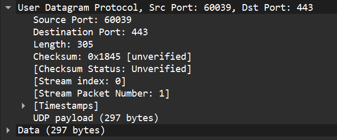
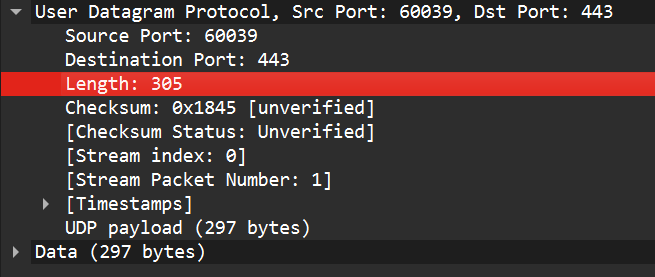
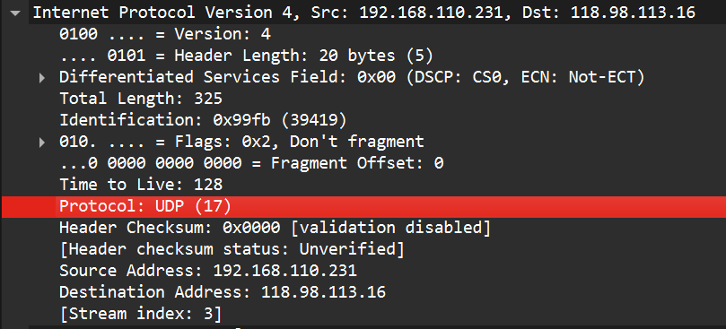
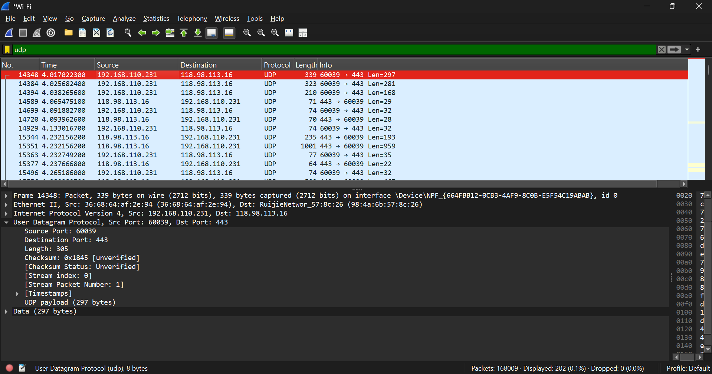
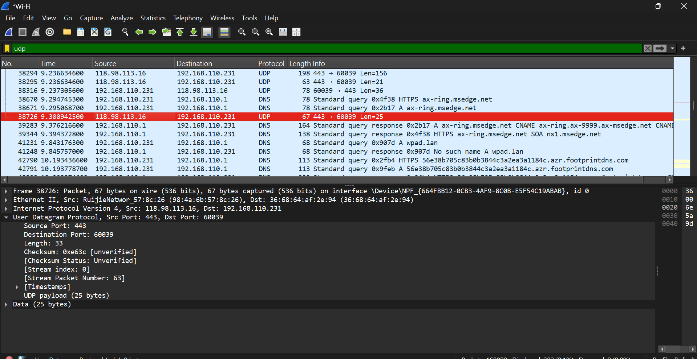

# Modul 5
## Langkah-langkah : UDP

1. Jalankan aplikasi Wireshark kemudian pilih interface jaringan yang sedang digunakan (Wi-Fi).
2. Mulai proses perekaman paket dengan menekan tombol **Start**.
3. Buat lalu lintas UDP melalui Command Prompt menggunakan perintah **nslookup google.com**.
4. Setelah paket berhasil direkam, kembali ke Wireshark dan hentikan proses capture dengan memilih tombol **Stop**.
5. Gunakan filter **udp** untuk menampilkan paket-paket yang menggunakan protokol UDP.
6. Pilih salah satu paket UDP yang muncul pada hasil capture.
7. Buka bagian **User Datagram Protocol** pada detail paket untuk melihat informasi header UDP.

## Pertanyaan

### 1. Pilih satu paket UDP yang terdapat pada trace Anda. Dari paket tersebut, berapa banyak “field” yang terdapat pada header UDP? Sebutkan nama-nama field yang Anda temukan!

Berdasarkan hasil analisis paket UDP pada Wireshark, diketahui bahwa header UDP memiliki empat field utama yang digunakan dalam proses komunikasi data. Keempat field tersebut adalah:

- Source Port
- Destination Port
- Length
- Checksum

---

### 2. Perhatikan informasi “content field” pada paket yang Anda pilih di pertanyaan 1. Berapa panjang (dalam satuan byte) masing-masing “field” yang terdapat pada header UDP?

Header UDP mempunyai ukuran total sebesar 8 byte. Struktur header ini terdiri dari empat field yang masing-masing berukuran 16 bit atau setara dengan 2 byte.

Rincian ukuran setiap field adalah sebagai berikut:

- Source Port : 2 byte
- Destination Port : 2 byte
- Length : 2 byte
- Checksum : 2 byte

---

### 3. Nilai yang tertera pada "Length" menyatakan nilai apa? Verifikasi jawaban Anda melalui paket UDP pada trace.

Field **Length** menunjukkan ukuran keseluruhan datagram UDP yang dikirimkan melalui jaringan. Nilai ini mencakup ukuran header UDP dan ukuran data (payload) yang dibawa.

Dari hasil pengamatan pada Wireshark, nilai Length yang diperoleh adalah 305 byte. Karena ukuran header UDP adalah 8 byte, maka ukuran payload dapat dihitung sebagai berikut:

Payload = 305 - 8 = 297 byte

Perhitungan tersebut membuktikan bahwa field Length merepresentasikan jumlah ukuran header dan data dalam satu paket UDP.

---

### 4. Berapa jumlah maksimum byte yang dapat disertakan dalam payload UDP?

Kapasitas maksimum payload UDP adalah 65.527 byte. Nilai ini diperoleh dari ukuran maksimum field Length sebesar 65.535 byte yang dikurangi ukuran header UDP sebesar 8 byte.

Perhitungan:

65.535 - 8 = 65.527 byte

Dengan demikian, jumlah data terbesar yang dapat dibawa oleh satu paket UDP adalah 65.527 byte.

---

### 5. Berapa nomor port terbesar yang dapat menjadi port sumber?

Nomor port terbesar yang dapat digunakan sebagai source port adalah **65535**.

Hal tersebut dikarenakan field Source Port memiliki panjang 16 bit, sehingga nilai maksimum yang dapat direpresentasikan adalah:

2^16 - 1 = 65535

---

### 6. Berapa nomor protokol untuk UDP?

UDP menggunakan nomor protokol **17** dalam format desimal atau **0x11** dalam format heksadesimal.

Informasi tersebut dapat ditemukan pada field **Protocol** yang terdapat pada header Internet Protocol (IP) di Wireshark.

---

### 7. Periksa pasangan paket UDP di mana host Anda mengirimkan paket UDP pertama dan paket UDP kedua merupakan balasan dari paket UDP yang pertama.

Pada komunikasi UDP, paket balasan akan menggunakan pasangan port yang berkebalikan dengan paket permintaan.

Pada paket pertama diperoleh informasi:

- Source Port = 60039
- Destination Port = 443

Sedangkan pada paket balasan diperoleh:

- Source Port = 443
- Destination Port = 60039

Hal tersebut menunjukkan bahwa server mengirimkan respons kembali ke port asal milik klien. Oleh karena itu, source port dan destination port bertukar posisi antara paket permintaan dan paket balasan.