# Modul 6 TCP

# Menangkap Transfer TCP dalam Jumlah Besar dari Komputer Pribadi ke Remote Server

## Langkah-langkah :

1. Unduh file **alice.txt** melalui alamat berikut:
   http://gaia.cs.umass.edu/wireshark-labs/alice.txt

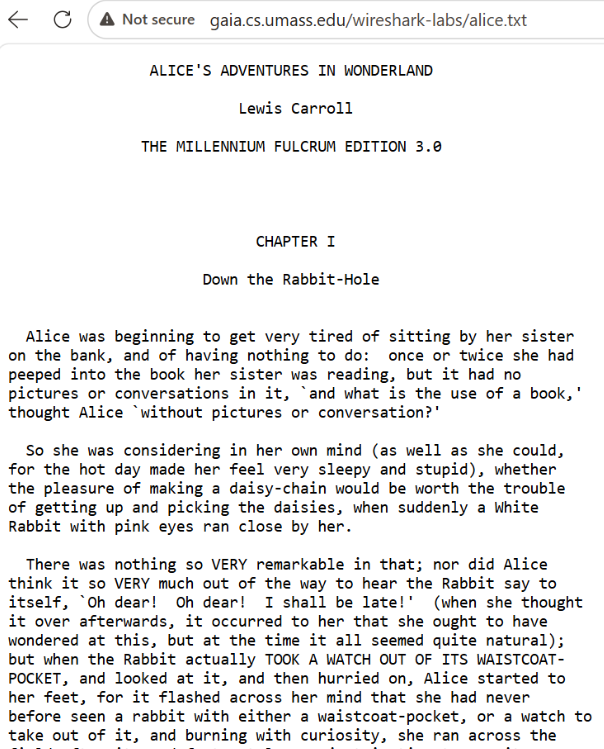

2. Setelah proses download selesai, buka halaman berikut:

   http://gaia.cs.umass.edu/wireshark-labs/TCP-wireshark-file1.html

   Kemudian unggah file **alice.txt** yang telah diunduh.

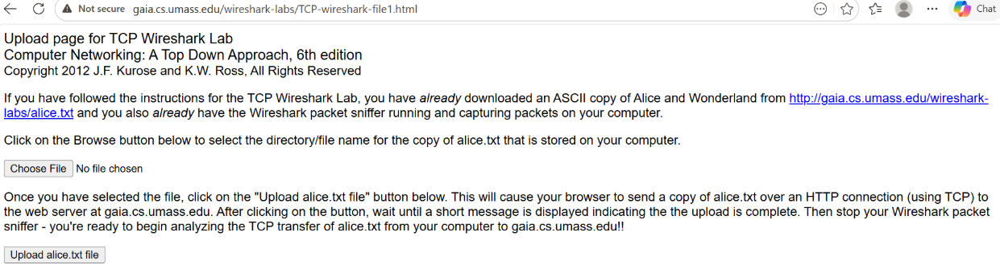

3. Jalankan Wireshark dan mulai proses capture paket. Setelah itu kembali ke browser dan lakukan upload file **alice.txt**. Jika proses upload telah selesai, hentikan capture pada Wireshark.

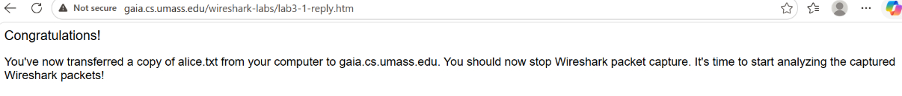

4. Pada kolom filter Wireshark, masukkan filter berikut:

   ```text
   tcp contains "POST"
   ```

   Filter tersebut digunakan untuk menemukan paket yang berisi proses upload file.

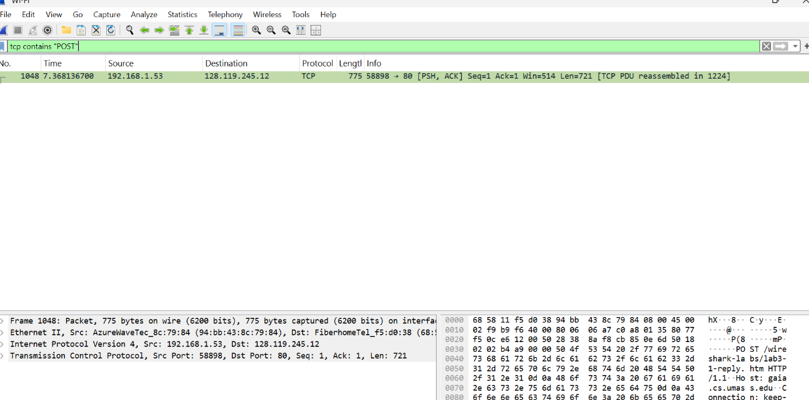

## Pertanyaan

### 1. Berapa alamat IP dan nomor port TCP yang digunakan oleh komputer klien (sumber) untuk mentransfer file ke gaia.cs.umass.edu?

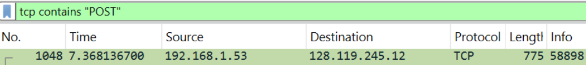

Berdasarkan hasil pengamatan paket HTTP POST pada Wireshark, komputer klien menggunakan alamat IP **192.168.1.53** dan nomor port TCP **58898** ketika melakukan transfer file ke server.

---

### 2. Apa alamat IP dari gaia.cs.umass.edu? Pada nomor port berapa ia mengirim dan menerima segmen TCP untuk koneksi ini?

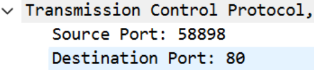

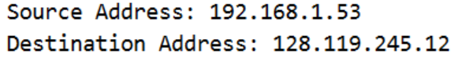

Dari hasil analisis paket yang ditangkap, diketahui bahwa server **gaia.cs.umass.edu** memiliki alamat IP **128.119.245.12**. Server tersebut menggunakan port **80** untuk menerima dan mengirim segmen TCP karena layanan yang digunakan adalah HTTP.

---

### 3. Berapa alamat IP dan nomor port TCP yang digunakan oleh komputer klien Anda (sumber) untuk mentransfer ke gaia.cs.umass.edu?

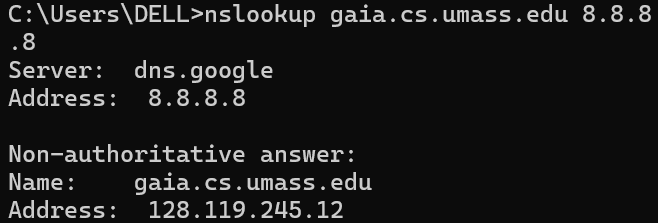

Berdasarkan hasil capture Wireshark, alamat IP tujuan yang digunakan adalah **128.119.245.12**. Hasil tersebut sesuai dengan keluaran perintah:

```bash
nslookup gaia.cs.umass.edu 8.8.8.8
```

Karena alamat IP yang diperoleh dari DNS sama dengan yang terlihat pada hasil capture, dapat disimpulkan bahwa proses resolusi DNS berjalan dengan benar.

# Uji Coba Dasar TCP

## Langkah-langkah :

1. Download dan ekstrak file berikut:

   http://gaia.cs.umass.edu/wireshark-labs/wireshark-traces.zip

2. Buka file **tcp-ethereal-trace-1** menggunakan Wireshark.

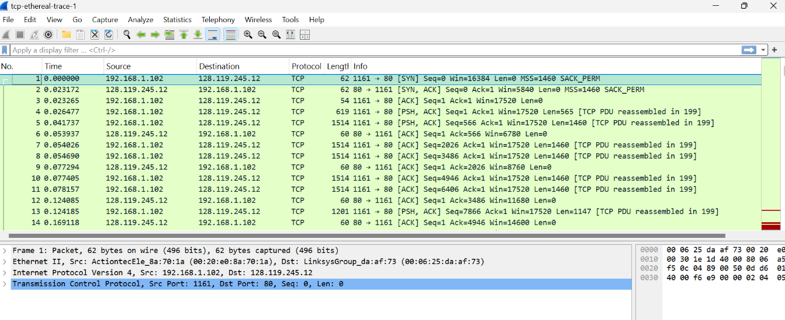

## Pertanyaan

### 1. Berapa nomor urut segmen TCP SYN yang digunakan untuk memulai sambungan TCP antara komputer klien dan gaia.cs.umass.edu? Apa yang dimiliki segmen tersebut sehingga teridentifikasi sebagai segmen SYN?

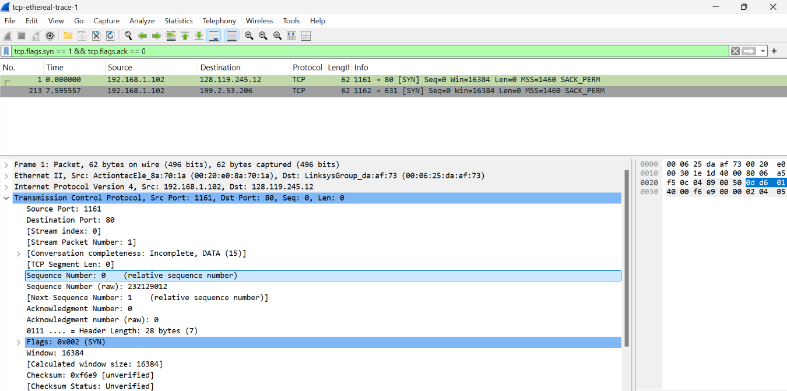

Dengan menggunakan filter:

```text
tcp.flags.syn == 1 && tcp.flags.ack == 0
```

diperoleh segmen TCP SYN dengan **Sequence Number = 0**. Paket tersebut dikenali sebagai segmen SYN karena memiliki nilai **SYN = 1** dan **ACK = 0**, yang menunjukkan bahwa paket digunakan untuk memulai pembentukan koneksi TCP.

---

### 2. Berapa nomor urut segmen SYNACK yang dikirim oleh gaia.cs.umass.edu ke komputer klien sebagai balasan dari SYN? Berapa nilai dari field Acknowledgement pada segmen SYNACK? Bagaimana gaia.cs.umass.edu menentukan nilai tersebut? Apa yang dimiliki oleh segmen sehingga teridentifikasi sebagai segmen SYNACK?

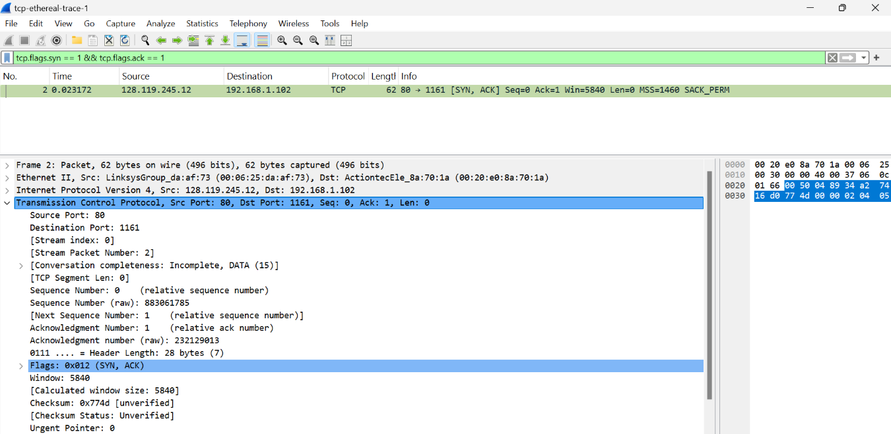

Dengan filter:

```text
tcp.flags.syn == 1 && tcp.flags.ack == 1
```

diperoleh segmen TCP SYN-ACK dengan **Sequence Number = 0** dan **Acknowledgement Number = 1**.

Nilai acknowledgment diperoleh dari Sequence Number pada paket SYN sebelumnya yang bernilai 0, kemudian ditambahkan 1. Paket ini dikenali sebagai SYN-ACK karena memiliki nilai **SYN = 1** dan **ACK = 1**, yang menandakan bahwa server menerima permintaan koneksi dan memberikan respons dalam proses three-way handshake.

---

### 3. Berapa nomor urut segmen TCP yang berisi perintah HTTP POST?

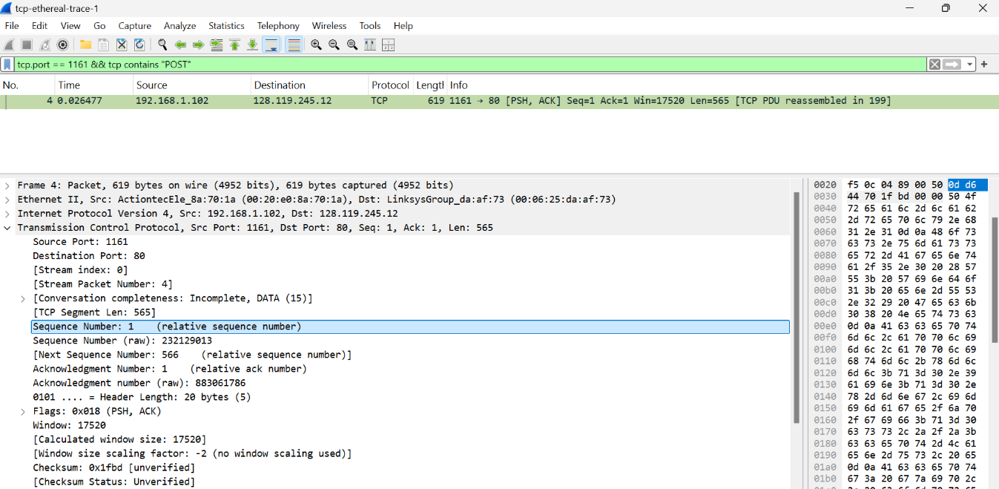

Berdasarkan filter:

```text
tcp.port == 1161 && tcp contains "POST"
```

diperoleh bahwa segmen yang membawa perintah HTTP POST memiliki **Sequence Number = 1**. Segmen tersebut merupakan awal pengiriman data dari klien ke server setelah koneksi TCP berhasil dibentuk.

---

### 4. Hitung RTT, waktu kirim, waktu ACK, dan Estimated RTT

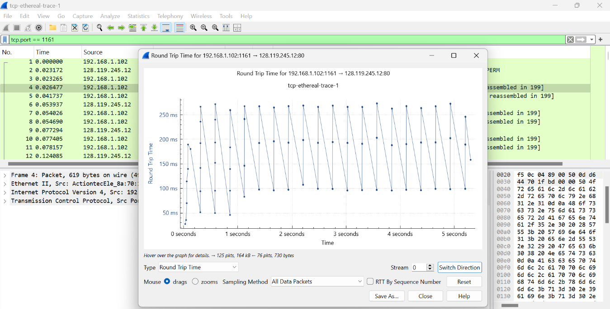

Melalui menu **Statistics → TCP Stream Graph → Round Trip Time**, diperoleh nilai RTT yang berada pada rentang sekitar **50 ms hingga 270 ms**.

RTT dihitung dari selisih waktu antara saat segmen dikirim dan saat ACK diterima kembali oleh pengirim. Perbedaan nilai RTT yang muncul dipengaruhi oleh kondisi jaringan pada saat proses komunikasi berlangsung.

---

### 5. Berapa panjang setiap enam segmen TCP pertama?

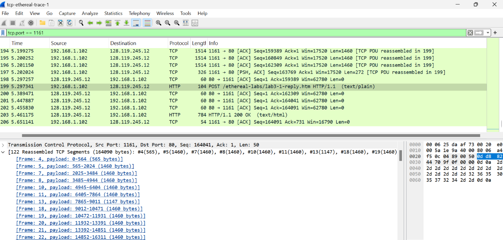

Hasil pengamatan pada bagian **Reassembled TCP Segments** menunjukkan bahwa enam segmen TCP pertama memiliki ukuran:

- 565 byte
- 1460 byte
- 1460 byte
- 1460 byte
- 1460 byte
- 1460 byte

Total ukuran keenam segmen tersebut adalah:

```text
565 + 1460 + 1460 + 1460 + 1460 + 1460 = 7865 byte
```

---

### 6. Berapa jumlah minimum ruang buffer tersedia yang disarankan kepada penerima dan diterima untuk seluruh trace? Apakah kurangnya ruang buffer penerima pernah menghambat pengiriman?

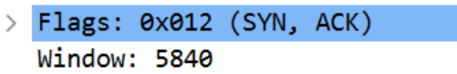

Dari hasil analisis diperoleh nilai minimum **window size** sebesar **5840 byte**. Nilai ini menunjukkan kapasitas buffer yang tersedia pada sisi penerima selama proses komunikasi berlangsung.

Selama pengamatan tidak ditemukan indikasi bahwa keterbatasan buffer menghambat pengiriman data. Hal tersebut ditunjukkan dengan tidak adanya retransmission akibat buffer penuh maupun penurunan performa yang signifikan.

---

### 7. Apakah ada segmen yang ditransmisikan ulang dalam file trace?

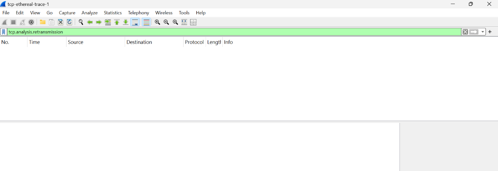

Pemeriksaan dilakukan menggunakan filter:

```text
tcp.analysis.retransmission
```

Hasilnya menunjukkan bahwa tidak terdapat paket retransmission pada trace yang dianalisis. Dengan demikian, proses komunikasi berlangsung tanpa pengiriman ulang segmen TCP.

---

### 8. Berapa banyak data yang biasanya diakui oleh penerima dalam ACK? Dapatkah anda mengidentifikasi kasus-kasus di mana penerima melakukan ACK untuk setiap segmen yang diterima?

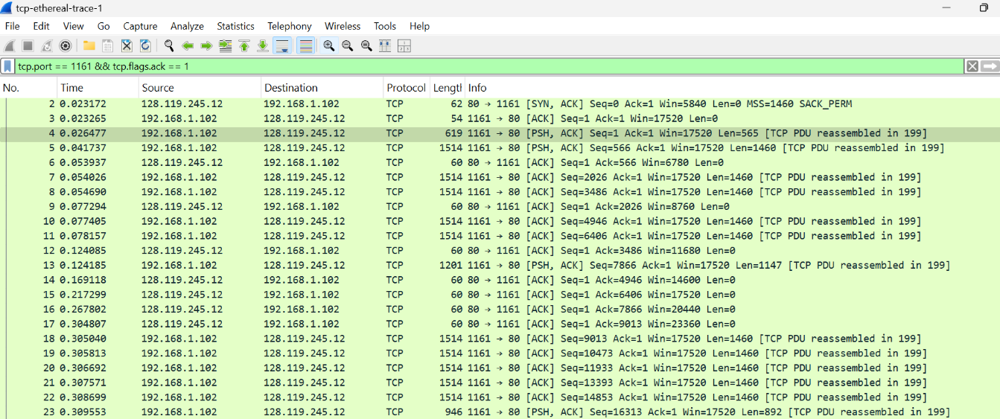

Berdasarkan hasil analisis paket ACK, terlihat bahwa nilai acknowledgment number meningkat dalam jumlah yang cukup besar setiap kali ACK dikirim.

Hal ini menunjukkan bahwa penerima menerapkan mekanisme **cumulative ACK**, yaitu mengakui beberapa segmen data sekaligus. Oleh karena itu, ACK tidak selalu dikirim untuk setiap segmen yang diterima secara individual.

---

### 9. Berapa throughput (byte yang ditransfer per satuan waktu) untuk sambungan TCP?

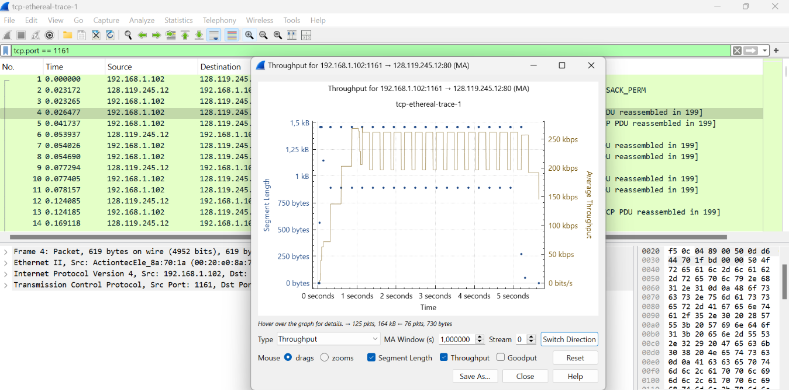

Nilai throughput diperoleh melalui menu **Statistics → TCP Stream Graph → Throughput** pada Wireshark.

Berdasarkan grafik yang ditampilkan, throughput koneksi TCP berada pada kisaran **200 kbps hingga 260 kbps**. Nilai tersebut menggambarkan jumlah data yang berhasil ditransmisikan setiap satuan waktu selama koneksi berlangsung.

# Congestion Control Pada TCP

## Langkah-langkah :

### 1. Identifikasi Slow Start dan Congestion Avoidance (file tcp-ethereal-trace-1)

- Buka file **tcp-ethereal-trace-1** menggunakan Wireshark.
- Terapkan filter **TCP**.
- Pilih menu **Statistics → TCP Stream Graph → Time-Sequence Graph (Stevens)**.

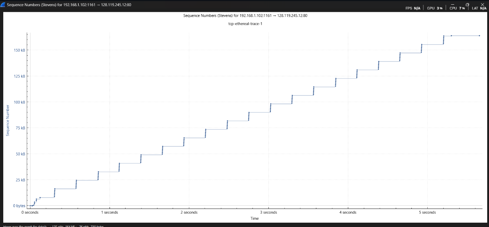

Pada awal grafik, sekitar 0 hingga 1 detik, terlihat kenaikan sequence number yang sangat cepat. Kondisi tersebut menunjukkan fase **slow start**.

Setelah itu, peningkatan sequence number menjadi lebih stabil dan cenderung linear. Perubahan pola ini menunjukkan bahwa koneksi telah memasuki fase **congestion avoidance**.

Meskipun terdapat sedikit variasi akibat delay dan ACK, grafik tetap menunjukkan kondisi jaringan yang stabil karena tidak terjadi penurunan tajam.

---

### 2. Identifikasi Slow Start dan Congestion Avoidance (alice.txt)

- Jalankan Wireshark dan mulai capture pada interface Wi-Fi.
- Unggah file **alice.txt** ke halaman:

  http://gaia.cs.umass.edu/wireshark-labs/TCP-wireshark-file1.html

- Setelah upload selesai, gunakan filter **TCP** dan buka grafik Time-Sequence.

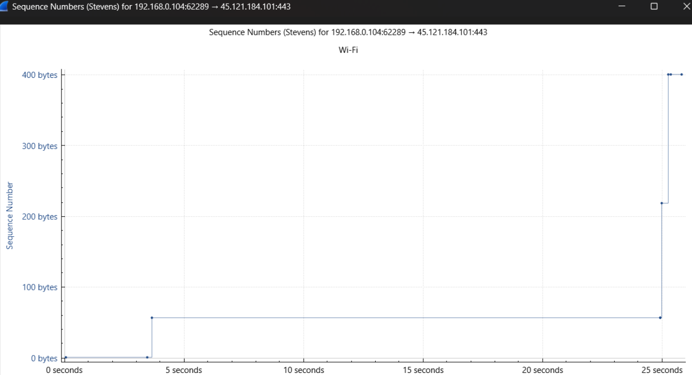

Pada grafik hasil upload file **alice.txt**, kenaikan sequence number pada awal komunikasi tidak terlihat sejelas grafik sebelumnya. Setelah beberapa saat muncul peningkatan data yang cukup besar dalam bentuk lonjakan.

Pola yang terbentuk juga tidak menunjukkan kenaikan linear yang konsisten, melainkan berupa beberapa lonjakan pada waktu tertentu. Hal ini kemungkinan dipengaruhi oleh variasi delay pada jaringan Wi-Fi yang digunakan selama proses pengambilan data.

Walaupun demikian, tidak ditemukan penurunan sequence number yang signifikan sehingga koneksi masih dapat dianggap stabil dan tidak menunjukkan adanya packet loss dalam jumlah besar.