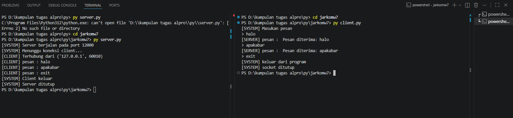
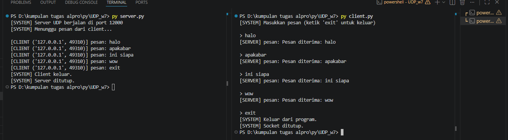

# Modul 7 Socket Programming

# TCP

## TCP Client

```python
from socket import *

serverName = "localhost"
serverPort = 12000

clientSocket = socket(AF_INET, SOCK_STREAM)

clientSocket.connect(
    (serverName, serverPort)
)

print("[SYSTEM] Masukan pesan")

running = True
while running:

    message = input("> ")

    clientSocket.send(message.encode())

    if message.lower() == "exit":
        print("[SYSTEM] Keluar dari program")
        running = False
        break

    modifiedMessage = clientSocket.recv(2048)

    print("[SERVER] pesan:", modifiedMessage.decode())

clientSocket.close()
print("[SYSTEM] socket ditutup")
```

## TCP Server

```python
from socket import *

serverPort = 12000
serverSocket = socket(AF_INET, SOCK_STREAM)

serverSocket.bind(
    ('', serverPort)
)

serverSocket.listen(1)
print("[SYSTEM] Server TCP siap digunakan")

running = True
while running:

    connectionSocket, addr = serverSocket.accept()

    while True:
        message = connectionSocket.recv(2448).decode()

        if not message:
            break

        if message.lower() == "exit":
            print("[SYSTEM] Client mengakhiri koneksi")
            running = False
            break

        modifiedMessage = message.upper()

        print("[SERVER] Pesan diterima:", modifiedMessage)

        connectionSocket.send(
            modifiedMessage.encode()
        )

    connectionSocket.close()

serverSocket.close()
```

## Hasil yang Didapatkan



1. Jalankan program server terlebih dahulu melalui terminal.
2. Setelah server aktif, jalankan program client pada terminal yang berbeda.
3. Ketika client terhubung, server akan menerima permintaan koneksi dari client.
4. Client dapat mengirimkan pesan ke server melalui terminal.
5. Server menerima pesan tersebut, kemudian menampilkannya pada terminal server.
6. Jika client mengirimkan perintah **"exit"**, koneksi antara client dan server akan ditutup secara otomatis.

---

# UDP

## UDP Client

```python
from socket import *

serverName = "localhost"
serverPort = 12000

clientSocket = socket(AF_INET, SOCK_STREAM)
clientSocket.connect((serverName, serverPort))

print("[SYSTEM] Masukkan pesan")

while True:
    message = input("> ")

    if not message:
        continue

    clientSocket.send(message.encode())

    if message.lower() == "exit":
        print("Perintah exit dikirim. Menutup koneksi...")
        break
    elif message.lower() == "keluar":
        print("Menutup client...")
        break

    try:
        modifiedMessage = clientSocket.recv(2048)
        print(f"[SERVER] {modifiedMessage.decode()}\n")
    except timeout:
        print("Kesalahan: Server tidak merespons (Timeout)\n")

clientSocket.close()
print("[SYSTEM] Socket ditutup")
```

## UDP Server

```python
from socket import *

serverPort = 12000
serverSocket = socket(AF_INET, SOCK_STREAM)

serverSocket.bind(('', serverPort))
serverSocket.listen(1)

print("[SYSTEM] Server siap digunakan")

running = True
while running:
    connectionSocket, clientAddress = serverSocket.accept()

    print(
        f"[SYSTEM] Terhubung dengan {clientAddress[0]}:{clientAddress[1]}"
    )

    while True:
        message = connectionSocket.recv(2048)

        if not message:
            break

        original_message = message.decode().strip()

        if original_message.lower() == "exit":
            print("[SYSTEM] Mematikan server...")
            running = False
            break

        modifiedMessage = original_message.upper()

        print(
            f"Diterima dari {clientAddress[0]}:{clientAddress[1]}: {original_message}"
        )

        print(f"Mengirim balik: {modifiedMessage}")

        connectionSocket.send(modifiedMessage.encode())

    connectionSocket.close()

serverSocket.close()
print("[SYSTEM] Server ditutup")
```

## Hasil yang Didapatkan



1. Jalankan program server terlebih dahulu.
2. Selanjutnya jalankan program client.
3. Client mengirimkan pesan ke server melalui koneksi yang telah dibuat.
4. Server menerima pesan tersebut dan mengubah seluruh karakter menjadi huruf kapital sebelum mengirimkannya kembali.
5. Untuk mengakhiri komunikasi, pengguna dapat mengetikkan perintah **"exit"**.

---

# Perbedaan TCP dan UDP

TCP (*Transmission Control Protocol*) merupakan protokol yang bersifat **connection-oriented**, sehingga koneksi harus dibangun terlebih dahulu sebelum data dapat dikirimkan. TCP menjamin bahwa data diterima secara lengkap, berurutan, dan tanpa duplikasi. Oleh karena itu, TCP lebih andal, meskipun membutuhkan proses tambahan yang menyebabkan pengiriman data menjadi relatif lebih lambat.

Sebaliknya, UDP (*User Datagram Protocol*) bersifat **connectionless**, sehingga data dapat dikirim langsung tanpa perlu membangun koneksi terlebih dahulu. UDP memiliki keunggulan dari sisi kecepatan karena tidak melakukan pengecekan dan pengendalian yang kompleks. Namun, UDP tidak menjamin bahwa data akan sampai ke tujuan, urutan data tetap terjaga, maupun tidak terjadi kehilangan paket.

Secara umum, TCP lebih cocok digunakan pada aplikasi yang membutuhkan keakuratan dan keandalan data, seperti layanan web, email, dan transfer file. Sementara itu, UDP lebih sesuai digunakan pada aplikasi yang mengutamakan kecepatan dan toleran terhadap kehilangan paket, seperti streaming video, komunikasi suara, dan permainan daring (*online gaming*).