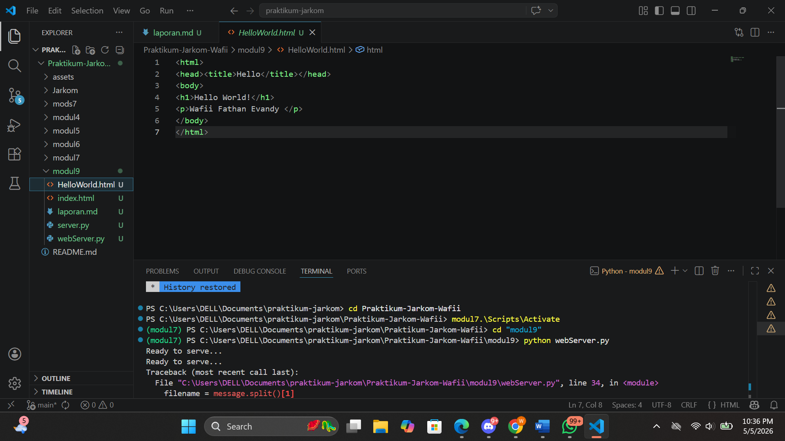
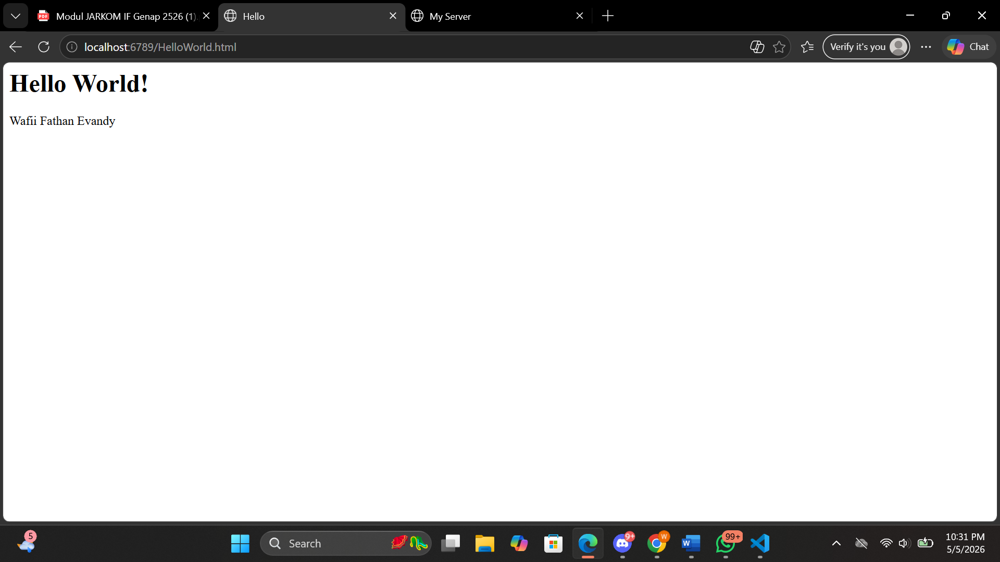
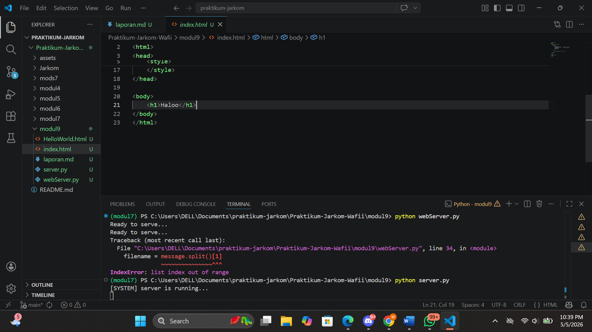
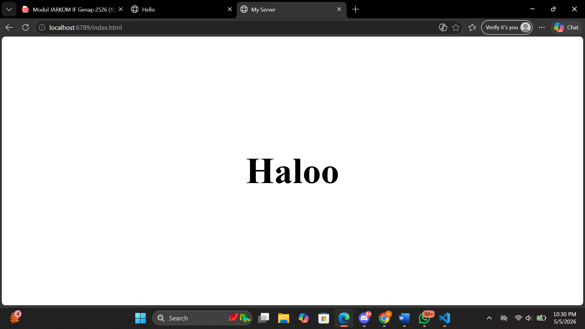

# Modul 9

# Web Server

Pada praktikum ini dilakukan penyempurnaan kode *skeleton web server* menggunakan bahasa Python. Program yang dibuat memanfaatkan protokol TCP dengan port 6789. Server berfungsi untuk menerima koneksi dari client, memproses permintaan HTTP yang masuk, membaca file HTML yang diminta oleh browser, kemudian mengirimkan isi file tersebut sebagai respons. Jika file yang diminta tidak tersedia, server akan mengembalikan pesan kesalahan **404 Not Found**.

## Langkah-Langkah Membuat Web Server

1. Buat file **webServer.py** sesuai dengan kode program yang telah disediakan.

2. Jalankan program tersebut melalui terminal atau VS Code. Jika berhasil dijalankan, tampilan pada terminal akan terlihat seperti berikut.



3. Buka browser kemudian akses alamat sesuai dengan nama file HTML yang digunakan, misalnya:

```text
http://localhost:6789/HelloWorld.html
```

Jika server berjalan dengan baik, halaman web akan ditampilkan seperti pada gambar berikut.



---

# Latihan

# Server

## Langkah-Langkah

1. Buat file **server.py** sesuai dengan kode program yang telah disiapkan.

2. Jalankan program server tersebut. Setelah berhasil dijalankan, tampilan terminal akan terlihat seperti gambar berikut.



3. Selanjutnya buka browser dan akses alamat sesuai dengan nama file HTML yang tersedia, misalnya:

```text
http://localhost:6789/index.html
```

Apabila server berhasil memproses permintaan dari browser, halaman web akan tampil seperti pada gambar berikut.



## Hasil Pengamatan

Berdasarkan percobaan yang telah dilakukan, web server mampu menerima permintaan HTTP dari browser dan mengirimkan file HTML yang diminta kepada client. Ketika browser mengakses alamat yang sesuai dengan file yang tersedia pada server, halaman web dapat ditampilkan dengan baik. Sebaliknya, apabila file yang diminta tidak ditemukan, server akan memberikan respons kesalahan berupa **404 Not Found**. Hal ini menunjukkan bahwa mekanisme dasar komunikasi antara browser dan web server telah berjalan dengan benar.